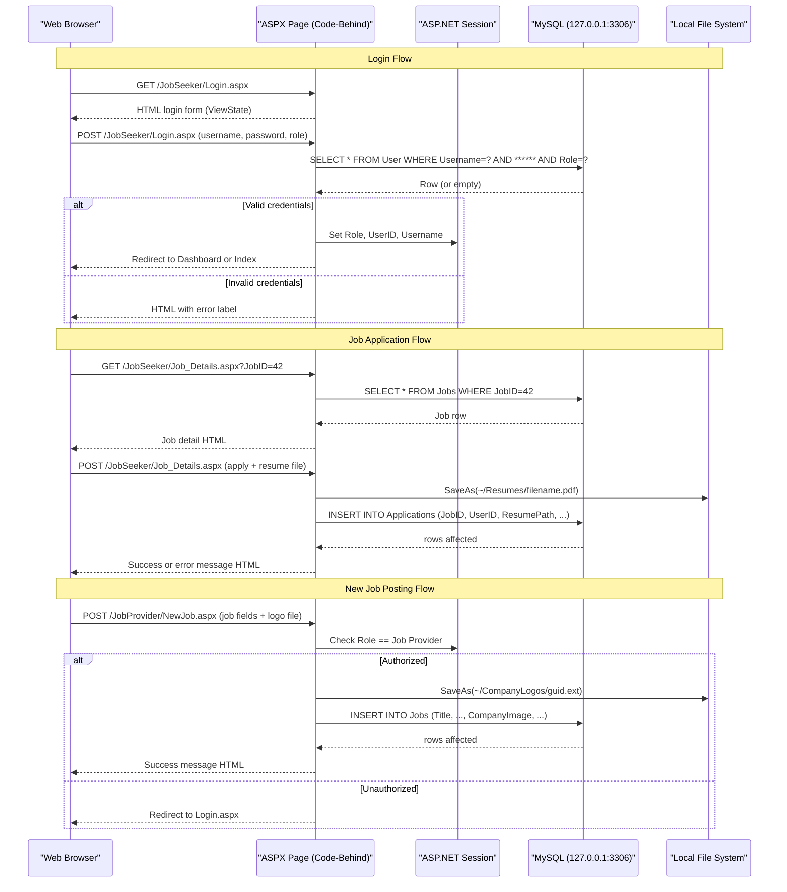

# API & Service Communication Contracts

The Job Portal is a single-tier ASP.NET WebForms application that exposes its functionality exclusively through server-rendered HTML pages using HTTP POST/GET form submissions — there are no REST APIs, GraphQL endpoints, or web services of any kind.

## Service Catalog

| Service | Port | Category | Purpose |
|---|---|---|---|
| Job_Portal (IIS/ASP.NET) | 80 / 443 (IIS) | Business | Single monolithic web application serving both Job Seeker and Job Provider roles |
| MySQL | 3306 | Infrastructure | Relational database (server=127.0.0.1, DB=OnlineJobPortal) |

> Note: There are no microservices, Docker Compose definitions, or multi-project solutions. The application is a single IIS-hosted ASP.NET WebForms monolith.

## API Endpoints Inventory

The application uses ASP.NET WebForms page postbacks rather than REST endpoints. All "endpoints" are server-rendered .aspx pages that accept HTTP GET (page load) and HTTP POST (form submit) requests via the ASP.NET `__VIEWSTATE` + `__EVENTVALIDATION` postback mechanism.

| Page (Service) | Method | Path | Triggered By | Action |
|---|---|---|---|---|
| Login | GET | /JobSeeker/Login.aspx | Direct navigation | Renders login form |
| Login | POST | /JobSeeker/Login.aspx | btnLogin click | Authenticates user; sets Session; redirects |
| Register | GET | /JobSeeker/Register.aspx | Link from Login | Renders registration form |
| Register | POST | /JobSeeker/Register.aspx | btnRegister click | Inserts new User row; shows success/error |
| Index (Home) | GET | /JobSeeker/Index.aspx | Redirect after login | Job Seeker landing page |
| Job_Listing | GET | /JobSeeker/Job_Listing.aspx | Navigation | Renders paginated job list |
| Job_Listing | POST | /JobSeeker/Job_Listing.aspx | Search/page controls | Filters and paginates job results |
| Job_Details | GET | /JobSeeker/Job_Details.aspx?JobID={id} | Job list link | Loads job details by JobID query string |
| Job_Details | POST | /JobSeeker/Job_Details.aspx | btnApply click | Inserts job application; uploads resume file |
| Profile (Seeker) | GET | /JobSeeker/Profile.aspx | Navigation | Loads Job Seeker profile from DB |
| Profile (Seeker) | POST | /JobSeeker/Profile.aspx | btnUpdate click | Updates User row; optionally uploads photo |
| ResumeBuild | GET | /JobSeeker/ResumeBuild.aspx | Navigation | Loads existing resume data |
| ResumeBuild | POST | /JobSeeker/ResumeBuild.aspx | Save/Generate click | Saves resume data; generates PDF via iTextSharp |
| GenerateResume | GET | /JobSeeker/GenerateResume.aspx | Navigation | Resume generation UI |
| Contact (Seeker) | POST | /JobSeeker/Contact.aspx | btnsend click | Inserts Contact row into DB |
| Dashboard | GET | /JobProvider/Dashboard.aspx | Redirect after login | Loads KPI counts and chart JSON |
| NewJob | GET | /JobProvider/NewJob.aspx | Navigation | Renders new job form |
| NewJob | POST | /JobProvider/NewJob.aspx | btnAdd click | Inserts Jobs row; uploads company logo |
| JobList | GET | /JobProvider/JobList.aspx | Navigation | Lists all jobs by provider |
| JobList | POST | /JobProvider/JobList.aspx | Delete button | Deletes selected job row |
| ViewResume | GET | /JobProvider/ViewResume.aspx | Navigation | Lists job applications with resumes |
| ContactList | GET | /JobProvider/ContactList.aspx | Navigation | Lists contact form submissions |
| ProfileProvider | GET | /JobProvider/ProfileProvider.aspx | Navigation | Loads Job Provider profile |
| ProfileProvider | POST | /JobProvider/ProfileProvider.aspx | btnUpdate click | Updates User row; optionally uploads photo |

## Management & Observability Endpoints

| Service | Endpoint | Notes |
|---|---|---|
| Job_Portal | None | No health check endpoints configured |
| Job_Portal | None | No Swagger/OpenAPI UI |
| Job_Portal | None | No metrics or tracing endpoints |
| Job_Portal | None | No ASP.NET health middleware |

> The application has no management, observability, or diagnostics endpoints. There is no Application Insights integration, no Prometheus metrics export, and no structured health probe path.

## DTOs & Contracts

The application does not define any DTO classes, request models, or response models. All data flows through:

- **ASP.NET WebForms server controls** (TextBox, DropDownList, GridView) — values are read directly from `Control.Text` properties in code-behind, not via deserialized objects.
- **MySqlDataReader / DataTable** — database results are read row-by-row into local variables or bound directly to GridView/DataList controls.
- **Newtonsoft.Json anonymous objects** — the Dashboard page serializes chart data as anonymous `new { }` objects directly in code-behind for use by Chart.js on the client.

There are no OpenAPI/Swagger specifications, no protobuf `.proto` files, no GraphQL schemas, and no formal contract definitions of any kind.

## Communication Patterns

**Synchronous only**: All communication is synchronous, request-scoped, and in-process. There are no asynchronous message queues, event buses, background jobs, or inter-service HTTP calls.

**Data access**: Each page code-behind opens a `MySqlConnection`, executes parameterized SQL commands synchronously (`MySqlCommand.ExecuteNonQuery`, `ExecuteReader`, `ExecuteScalar`), and closes the connection within a `using` block. There is no connection pooling configuration; the default MySQL ADO.NET pool is used.

**Resilience patterns**: None. There are no retry policies, circuit breakers, timeouts, or bulkhead patterns. A database failure throws an unhandled exception (caught only at the page level with a generic `catch (Exception ex)` that displays the raw error message to the user).

**Service discovery**: Not applicable — the database is hardcoded to `server=127.0.0.1`. No service registry or DNS-based discovery is used.

**API gateway**: Not applicable — no gateway layer exists.

**Security posture**: Authentication is entirely session-based. There is no HTTPS enforcement configured in `Web.config`. No TLS redirect is present. Passwords are stored and compared in plaintext — there is no hashing. Role-based authorization is implemented as ad-hoc `Session["Role"]` string comparisons in each page's `Page_Load` handler; there is no centralized authorization middleware or `[Authorize]` attribute equivalent. No CSRF protection (ViewStateMAC may provide partial protection but is not explicitly enabled). No rate limiting, input sanitization, or Content Security Policy headers are configured.

## Service Technology Matrix

| Service | Web Framework | Data Access | Discovery | Gateway | Health Check | Cache | Metrics |
|---|---|---|---|---|---|---|---|
| Job_Portal | ASP.NET WebForms 4.7.2 | Raw ADO.NET (MySql.Data) | None | None | None | None (Session only) | None |
| MySQL | — | — | None | None | None | InnoDB buffer | None |

## Service Communication Sequence

