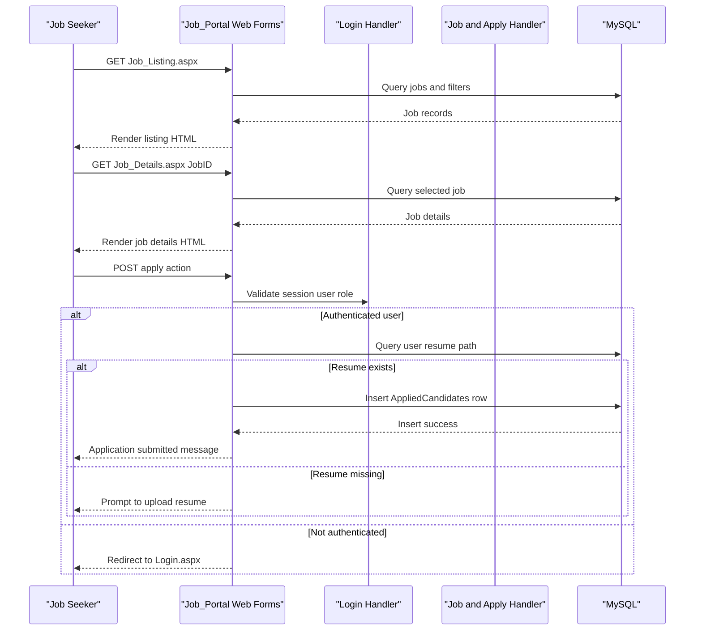

# API & Service Communication Contracts

The project exposes a page-based HTTP contract through ASP.NET Web Forms rather than a dedicated REST API surface. Communication is synchronous request-response between browser clients and server-side page handlers with direct database operations.

## Service Catalog

| Service | Port | Category | Purpose |
|---|---:|---|---|
| Job_Portal (Web Forms monolith) | 80/443 (IIS-hosted) | API Layer + Business | Serves job seeker/provider pages and handles all business operations |
| MySQL database | 3306 | Infrastructure | Persists users, jobs, contacts, and applications |

## API Endpoints Inventory

| Service | Method | Path | Request Type | Response Type |
|---|---|---|---|---|
| Job_Portal | GET | `/JobSeeker/Login.aspx` | Page request, query/cookie/session context | Rendered HTML page |
| Job_Portal | POST | `/JobSeeker/Login.aspx` | Form postback (`username`, `password`, `role`) | Redirect to dashboard/index or HTML with validation message |
| Job_Portal | POST | `/JobSeeker/Register.aspx` | Form postback for user registration fields | HTML success/failure message |
| Job_Portal | GET | `/JobSeeker/Job_Listing.aspx` | Query/filter controls | Rendered HTML list |
| Job_Portal | GET | `/JobSeeker/Job_Details.aspx?JobID={id}` | Path/query parameter (`JobID`) | Rendered HTML details |
| Job_Portal | POST | `/JobSeeker/Job_Details.aspx?JobID={id}` | Postback for apply action | HTML success/failure message |
| Job_Portal | POST | `/JobProvider/NewJob.aspx` | Form postback with job fields and optional file upload | HTML success/failure message |
| Job_Portal | POST | `/JobProvider/JobList.aspx` | Grid action postbacks (edit/delete/paging) | Updated HTML grid |
| Job_Portal | POST | `/JobProvider/ViewResume.aspx` | Grid action postback (delete/paging) | Updated HTML grid |
| Job_Portal | POST | `/JobProvider/ContactList.aspx` | Grid action postback (delete/paging) | Updated HTML grid |

## Management & Observability Endpoints

| Service | Endpoint | Custom Metrics (if any) |
|---|---|---|
| Job_Portal | None detected | None detected |

## DTOs & Contracts

The application primarily uses Web Forms controls and `DataTable`/`MySqlDataReader` objects as request and response contracts rather than explicit DTO classes. Key contract-level models are implicit:
- `Session` keys (`Username`, `UserID`, `Role`) as authentication context contract.
- Form-bound entities for registration, job posting, and application submission.
- Grid/list contracts for job listings, contacts, and applications.
No OpenAPI, Swagger, protobuf, or GraphQL contract files were detected.

## Communication Patterns

All communication is synchronous and in-process: browser requests are handled by page code-behind logic that executes SQL against MySQL. No asynchronous messaging, retry framework, circuit breaker library, service discovery, or gateway composition layer is configured. Startup dependency is limited to web host availability plus reachable MySQL connection.

Security posture at API contract level:
- No centralized API authentication middleware; authentication is session-based after login.
- Role checks are implemented in selected pages using session values.
- No repository evidence of explicit TLS enforcement configuration in application code.

## Service Technology Matrix

| Service | Web | Data Access | Discovery | Gateway | Actuator | Cache | Metrics |
|---|---|---|---|---|---|---|---|
| Job_Portal | ASP.NET Web Forms | MySqlConnection/MySqlCommand | None | None | None | None | None |

## Service Communication Sequence

