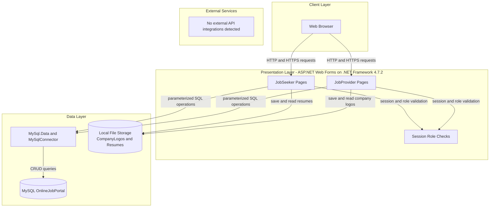
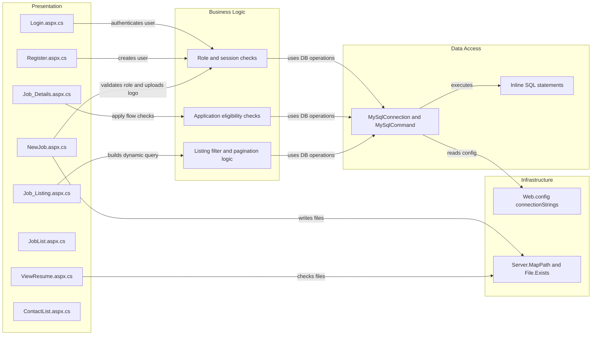

# Architecture Diagram

This application is a monolithic ASP.NET Web Forms portal with role-based flows for job seekers and job providers. It uses server-rendered pages with direct ADO.NET/MySQL data access and local file storage for uploaded assets.

## Application Architecture

### Technology Stack Summary

| Layer | Technology | Version | Purpose |
|---|---|---|---|
| Presentation | ASP.NET Web Forms | .NET Framework 4.7.2 | Server-rendered UI for seeker/provider workflows |
| Business Logic | Code-behind page handlers | In project source | Implements login, registration, posting, applying, and admin actions |
| Data Access | MySql.Data, MySqlConnector | 9.2.0, 2.4.0 | Database connectivity and SQL execution |
| Data Storage | MySQL | Not pinned in repo | Stores users, jobs, contacts, and applications |
| File Storage | Local filesystem | N/A | Stores resumes and company logo uploads |

### Data Storage & External Services

The application persists core business data in a single MySQL database and stores uploaded files in local folders inside the web app (`Resumes`, `CompanyLogos`). No message broker, cache tier, or outbound third-party service/API integration was identified.

### Key Architectural Decisions

- Uses a single monolithic Web Forms application instead of separate API and frontend services.
- Uses direct SQL from page code-behind files rather than repository/service abstractions.
- Uses session state role checks in page lifecycle methods for access control.

## Component Relationships

### Component Inventory

| Component | Layer | Type | Responsibility |
|---|---|---|---|
| Login.aspx.cs | Presentation | Web Forms page handler | Authenticates user and sets session context |
| Register.aspx.cs | Presentation | Web Forms page handler | Registers job seekers/providers |
| Job_Listing.aspx.cs | Presentation | Web Forms page handler | Filters and paginates job listings |
| Job_Details.aspx.cs | Presentation | Web Forms page handler | Shows details and submits applications |
| NewJob.aspx.cs | Presentation | Web Forms page handler | Creates jobs and uploads company logo |
| JobList.aspx.cs | Presentation | Web Forms page handler | Provider-side job management (edit/delete) |
| ViewResume.aspx.cs | Presentation | Web Forms page handler | Lists and manages candidate applications |
| ContactList.aspx.cs | Presentation | Web Forms page handler | Lists and deletes contact submissions |
| MySqlConnection/MySqlCommand | Data Access | DB access primitives | Executes parameterized SQL statements |
| Web.config connectionStrings | Infrastructure | Configuration source | Supplies MySQL connection details |
