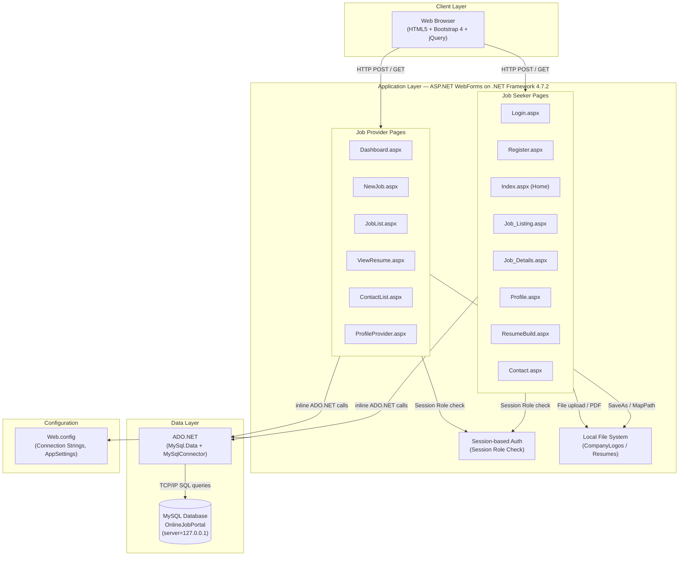
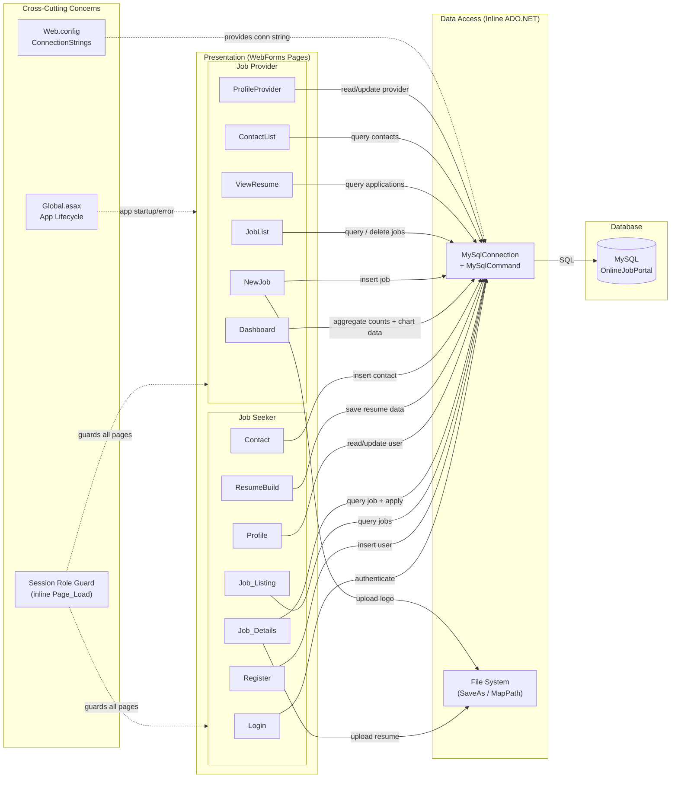

# Architecture Diagram

This document describes the application architecture and component relationships of the Job Portal web application — a .NET Framework 4.7.2 ASP.NET WebForms project targeting a MySQL database backend.

## Application Architecture

### Technology Stack Summary

| Layer | Technology | Version | Purpose |
|---|---|---|---|
| Presentation | ASP.NET WebForms | .NET Framework 4.7.2 | Server-side page rendering (.aspx + code-behind) |
| UI Framework | Bootstrap | 4.x | Responsive HTML/CSS layout |
| Scripting | jQuery + various JS plugins | varies | Client-side interactivity (Owl Carousel, Select2, etc.) |
| Data Access | MySql.Data (Oracle connector) | 9.2.0 | MySQL database driver (ADO.NET) |
| Data Access (alt) | MySqlConnector | 2.4.0 | Async-capable MySQL ADO.NET driver |
| PDF Generation | iTextSharp | 5.5.13.4 | Resume PDF generation |
| JSON Serialization | Newtonsoft.Json | 13.0.3 | JSON serialization (Dashboard charts) |
| Compiler | Microsoft.CodeDom.Providers.DotNetCompilerPlatform | 2.0.1 | Roslyn compiler for WebForms |
| Database | MySQL | (runtime) | Relational data store for users, jobs, applications |
| File Storage | Local file system | — | Company logos (CompanyLogos/) and resumes (Resumes/) |
| Configuration | Web.config (XML) | — | IIS/ASP.NET application configuration |

### Data Storage & External Services

The application uses a single **MySQL** relational database (`OnlineJobPortal`) accessed directly via ADO.NET with raw SQL queries. There is no ORM layer. The database hosts tables for users (`User`), jobs (`Jobs`), contact messages, resume data, and job applications. Company logo images and candidate resume files are stored on the **local web server file system** under `CompanyLogos/` and `Resumes/` directories respectively, referenced by relative paths in the database. No external services, message brokers, caches, or cloud integrations are present.

### Key Architectural Decisions

- **WebForms code-behind monolith**: All business logic and data access code is embedded directly inside ASP.NET code-behind (.aspx.cs) files — no service layer or repository pattern is used.
- **Session-based role authorization**: Authentication and authorization are performed by checking `Session["Role"]` in each page's `Page_Load` handler; there is no centralized authentication middleware.
- **Local file system for binary assets**: Company logos and PDF resumes are saved to and served from the local web server's file system, coupling the application to a single-instance IIS deployment.

## Component Relationships

### Component Inventory

| Component | Layer | Type | Responsibility |
|---|---|---|---|
| Login.aspx / Login.aspx.cs | Presentation | WebForms Page | User login; sets Session["Role"], Session["UserID"] |
| Register.aspx / Register.aspx.cs | Presentation | WebForms Page | New user registration for both Job Seekers and Job Providers |
| Index.aspx | Presentation | WebForms Page | Job Seeker landing/home page |
| Job_Listing.aspx / Job_Listing.aspx.cs | Presentation | WebForms Page | Paginated job listing with search/filter |
| Job_Details.aspx / Job_Details.aspx.cs | Presentation | WebForms Page | Job detail view; job application with resume upload |
| Profile.aspx / Profile.aspx.cs | Presentation | WebForms Page | Job Seeker profile view and update |
| ResumeBuild.aspx / ResumeBuild.aspx.cs | Presentation | WebForms Page | Structured resume builder and PDF generation |
| GenerateResume.aspx | Presentation | WebForms Page | Resume generation UI |
| Contact.aspx / Contact.aspx.cs | Presentation | WebForms Page | Contact form submission |
| JobSeeker.Master | Presentation | Master Page | Shared layout/navigation for Job Seeker section |
| Dashboard.aspx / Dashboard.aspx.cs | Presentation | WebForms Page | Job Provider dashboard with KPI counts and charts |
| NewJob.aspx / NewJob.aspx.cs | Presentation | WebForms Page | Create new job posting with company logo upload |
| JobList.aspx / JobList.aspx.cs | Presentation | WebForms Page | List, view, and delete job postings |
| ViewResume.aspx / ViewResume.aspx.cs | Presentation | WebForms Page | View and download job applicant resumes |
| ContactList.aspx / ContactList.aspx.cs | Presentation | WebForms Page | View contact form submissions |
| ProfileProvider.aspx / ProfileProvider.aspx.cs | Presentation | WebForms Page | Job Provider profile view and update |
| JobProvider.Master | Presentation | Master Page | Shared layout/navigation for Job Provider section |
| Global.asax / Global.asax.cs | Infrastructure | HTTP Application | Application startup, routing, error handling |
| Web.config | Infrastructure | Configuration | Connection strings, framework settings, assembly bindings |
