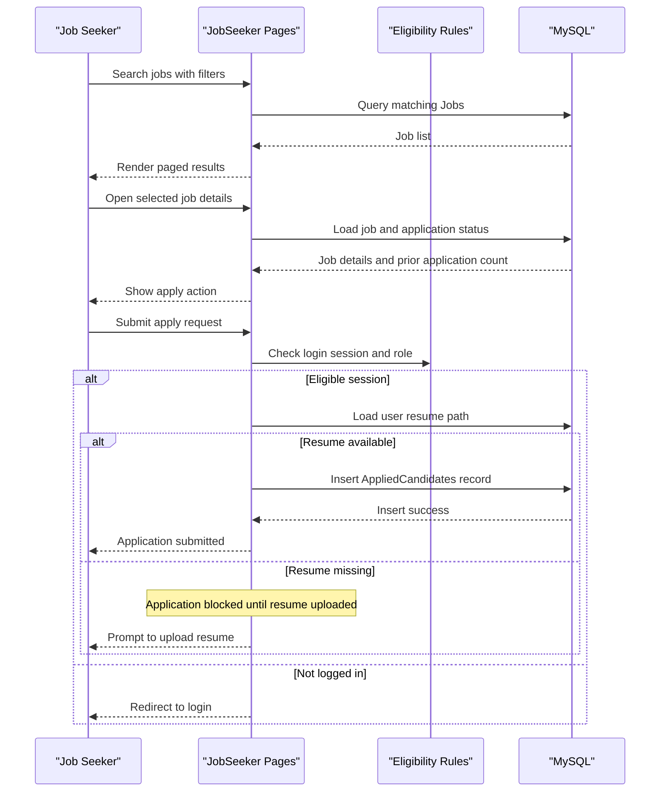

# Core Business Workflows

The application supports two primary user personas: job seekers discovering and applying to jobs, and job providers posting and managing listings. Business logic is implemented in page handlers that coordinate user input, eligibility checks, and persistent state updates.

## Domain Entities

| Entity | Service / Bounded Context | Description | Key Relationships |
|---|---|---|---|
| User | Identity and profile context | Represents authenticated job seekers and job providers | Links to applications and resumes |
| Jobs | Job publishing context | Represents openings created by providers | Receives multiple candidate applications |
| AppliedCandidates | Application processing context | Represents a seeker applying to a specific job | Connects User and Jobs |
| Contact | Communication context | Stores inbound contact messages | Managed by provider/admin view |
| Country | Reference data context | Stores country options used in forms | Referenced by user/job profile data |

## Service-to-Domain Mapping

| Service | Domain Context | Owned Entities | External Dependencies |
|---|---|---|---|
| JobSeeker pages | Discovery and application | User, Jobs (read), AppliedCandidates (write) | MySQL shared schema, session state |
| JobProvider pages | Job publishing and screening | Jobs (write), AppliedCandidates (manage), Contact (manage) | MySQL shared schema, local file storage |
| Shared monolith runtime | Identity and authorization context | User session and role context | ASP.NET session state |

## Primary Workflows

### Workflow 1: User registration and login

1. User submits registration form with role selection.
2. System attempts to create a `User` record.
3. On duplicate username or DB failure, user receives failure feedback.
4. User submits login form with username, password, and selected role.
5. System validates credentials and role, then stores `Username`, `UserID`, and `Role` in session.
6. User is redirected to seeker or provider landing page by role.

### Workflow 2: Job posting and maintenance by provider

1. Provider accesses posting page; role check validates session.
2. Provider submits job details and optional company logo.
3. System validates allowed image extension, stores logo file, and inserts a `Jobs` record.
4. Provider can edit or delete existing jobs via grid actions.
5. Changes are persisted immediately to `Jobs` table and reflected in UI.

### Workflow 3: Job search and application by seeker

1. Seeker opens listings and applies filters (location, experience, type, posted time).
2. System constructs filtered query and paginates result set.
3. Seeker opens a job details page and system checks whether already applied.
4. On apply, system verifies user is logged in and has a resume path.
5. If eligible, system inserts `AppliedCandidates` record; otherwise returns actionable message.

## Cross-Service Data Flows

Because the solution is a monolith, cross-service flow is implemented as cross-feature data composition over the same database. Job seeker flows read `Jobs` and `User`, then join job and user context by writing `AppliedCandidates`. Provider screening reads from `ViewAppliedCandidates` (derived join view) to combine candidate and job information for review. If prerequisite data is missing (for example, no uploaded resume), workflows degrade by returning user guidance instead of mutating state.

## Business Workflow Sequence

## Business Rules & Decision Logic

- Role-based access: provider-only pages validate `Session["Role"] == "Job Provider"`.
- Login decision rule: credential validation requires username, password, and role match.
- Application eligibility: seeker cannot apply if already applied or missing stored resume.
- File acceptance rule: company logo uploads are restricted to specific image extensions.
- State mutations are immediate and transactional per SQL statement (no saga/event choreography detected).
- Error handling surfaces database and validation outcomes directly to end users via status labels.
