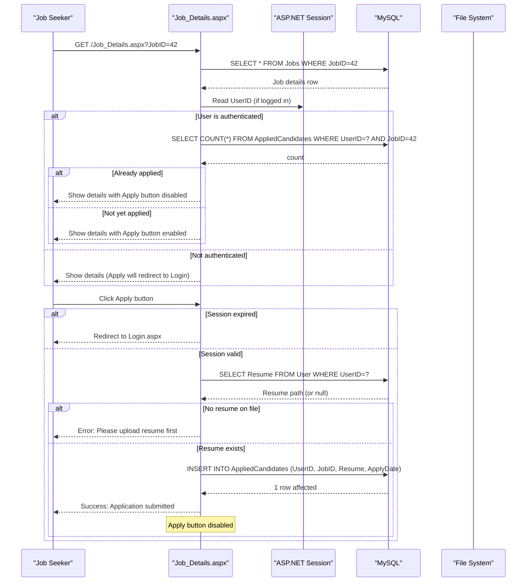

# Core Business Workflows

The Job Portal is an online recruitment platform that connects two distinct user roles — **Job Seekers** (candidates looking for employment) and **Job Providers** (employers posting vacancies) — through a shared web interface with role-based access to separate feature sets.

## Domain Entities

| Entity | Service / Bounded Context | Description | Key Relationships |
|---|---|---|---|
| User | Identity & Profile | Represents both Job Seekers and Job Providers; role distinguished by the `Role` field | Owns AppliedCandidates (as seeker), owns Jobs (as provider) |
| Jobs | Job Management | A job vacancy posted by a Job Provider, including requirements, compensation, and company info | Belongs to a provider (User); has many AppliedCandidates |
| AppliedCandidates | Application Management | Records a Job Seeker's application to a specific job, including resume reference and apply date | Links User (seeker) to Jobs; enforces one-application-per-seeker-per-job rule |
| Contact | Enquiry Management | A contact/enquiry message submitted by a visitor (not necessarily a logged-in user) | Independent entity; read by Job Providers via ContactList |
| Country | Reference Data | Lookup table of country names used in registration and job filtering | Referenced by User and Jobs |
| ViewAppliedCandidates | Application Management | Database VIEW joining User + Jobs + AppliedCandidates for the Job Provider's resume review screen | Read-only projection; not a base table |

## Service-to-Domain Mapping

The application is a single monolithic service. All bounded contexts are handled within one codebase with no formal domain separation. The table below maps logical business areas to the pages that own them:

| Logical Domain | Pages | Owned Entities | Notes |
|---|---|---|---|
| Identity & Authentication | Login.aspx, Register.aspx | User | Shared login for both roles; role selection on login and registration |
| Job Seeker Portal | Index.aspx, Job_Listing.aspx, Job_Details.aspx, Profile.aspx, ResumeBuild.aspx, Contact.aspx | User, AppliedCandidates | Role guard: Session["Role"] == "Job Seeker" |
| Job Provider Portal | Dashboard.aspx, NewJob.aspx, JobList.aspx, ViewResume.aspx, ContactList.aspx, ProfileProvider.aspx | Jobs, AppliedCandidates, Contact | Role guard: Session["Role"] == "Job Provider" |
| Reference Data | ResumeBuild.aspx (Country dropdown) | Country | Country list loaded from DB on page load |

## Primary Workflows

### Workflow 1: User Registration

1. New user navigates to `/JobSeeker/Register.aspx`.
2. User fills in: Username, Password, Confirm Password, Full Name, Address, Mobile, Email, Country, and selects Role (Job Seeker or Job Provider).
3. On submit, the system inserts a new row into the `User` table with the selected `Role` value.
4. **Uniqueness constraint**: If the username already exists, MySQL raises a DUPLICATE/UNIQUE violation; the page catches `MySqlException` and displays a username-already-exists message.
5. **Password confirmation**: Client-side or server-side ASP.NET validator checks that Password matches Confirm Password (ValidatorMode = None for unobtrusive JS).
6. On success, a success message is shown and the form is cleared. No automatic login or redirect to dashboard occurs after registration.

### Workflow 2: User Login and Role-Based Routing

1. User navigates to `/JobSeeker/Login.aspx`, selects a role (Job Seeker or Job Provider), enters credentials.
2. The system queries `User` table matching `Username`, `Password` (plaintext), and `Role`.
3. **Role validation**: If the selected role does not match the stored role, authentication fails with "Invalid credentials or user type mismatch."
4. On success: Session variables `Username`, `UserID`, and `Role` are set.
5. **Role-based redirect**:
   - Job Provider → `/JobProvider/Dashboard.aspx`
   - Job Seeker → `/JobSeeker/Index.aspx`
6. Every subsequent page checks `Session["Role"]` in `Page_Load`; unauthorized access redirects to Login.

### Workflow 3: Job Seeker — Browse and Apply for a Job

1. Authenticated Job Seeker navigates to `/JobSeeker/Job_Listing.aspx`.
2. Jobs are loaded from the `Jobs` table with optional filters (Country, JobType, keyword search) applied as dynamic `WHERE` clauses.
3. Results are paginated (5 jobs per page) using ViewState to track the current page index.
4. Seeker clicks a job → redirected to `/JobSeeker/Job_Details.aspx?JobID={id}`.
5. **Already-applied check**: On page load, the system queries `AppliedCandidates` for (UserID, JobID). If a record exists, the Apply button is disabled.
6. **Resume prerequisite check**: On Apply button click, the system queries `User.Resume` for the current user. If no resume path is stored, the application is blocked with "Please upload your resume before applying."
7. On valid apply: A row is inserted into `AppliedCandidates` (UserID, JobID, Resume path, ApplyDate=Now).
8. Apply button is disabled after successful submission.

### Workflow 4: Job Seeker — Build and Upload Resume

1. Authenticated Job Seeker navigates to `/JobSeeker/ResumeBuild.aspx`.
2. Existing resume data is loaded from the `User` table (educational grades, work experience, skills).
3. Seeker fills in structured resume fields (Tenth/Twelfth/Graduation/PostGraduation grades, PhD, current employer, experience, address).
4. On save, the `User` table is updated with all resume fields.
5. **PDF generation**: The system can generate a PDF resume using iTextSharp; the PDF file is saved to the `Resumes/` directory and the path is stored in `User.Resume`.
6. On the Profile page, the seeker can also upload a resume PDF directly, which updates `User.Resume` with the file path.

### Workflow 5: Job Provider — Post a New Job

1. Authenticated Job Provider navigates to `/JobProvider/NewJob.aspx`.
2. **Role guard**: `Session["Role"] != "Job Provider"` redirects to Login.
3. Provider fills in all job fields: title, number of posts, description, qualifications, experience, specialization, salary, job type, last date to apply, company details, and optionally uploads a company logo.
4. **File validation**: Logo upload validates file extension against an allowed list (.jpg, .jpeg, .png, .gif, .bmp, .webp). Invalid extensions are silently skipped (no logo saved).
5. Approved logo is saved to `CompanyLogos/` with a GUID-based filename.
6. A new row is inserted into the `Jobs` table with `CreateDate = NOW()`.
7. **ASP.NET validation controls**: `Page.IsValid` is checked before processing; server-side validators enforce required fields.

### Workflow 6: Job Provider — Review Applications and Download Resumes

1. Job Provider navigates to `/JobProvider/ViewResume.aspx`.
2. The system queries the `ViewAppliedCandidates` VIEW, which joins User + Jobs + AppliedCandidates.
3. A GridView lists all applications across all jobs with candidate name, email, mobile, apply date, company, and job title.
4. Provider can click a resume link to download/view the candidate's PDF (served from the `Resumes/` file system path).
5. Provider can delete an application record (`DELETE FROM AppliedCandidates WHERE ApplicationId=?`).

### Workflow 7: Job Provider Dashboard — KPI Monitoring

1. On login, Job Provider lands on `/JobProvider/Dashboard.aspx`.
2. Four aggregate counts are fetched: total Users, total Jobs, total Applications, total Contact submissions.
3. Chart data is fetched and serialized as JSON (anonymous object) for Chart.js visualization on the client side.

## Cross-Service Data Flows

The application is a monolith with no inter-service communication. All data flows are intra-process. The only data composition pattern is the `ViewAppliedCandidates` database VIEW, which pre-joins three tables (User, Jobs, AppliedCandidates) to produce the resume review list.

The closest equivalent to a "cross-service aggregation" is the job application flow, which reads from both `User` (to check resume) and `AppliedCandidates` (to check previous application) in separate queries within the same HTTP request — there is no circuit breaker or fallback for this pattern; a DB failure at any step surfaces as an unhandled exception.

## Business Workflow Sequence

## Business Rules & Decision Logic

### Validation Rules

| Rule | Location | Behavior |
|---|---|---|
| Username uniqueness | Register.aspx | MySQL UNIQUE constraint; MySqlException caught and shown as user error |
| Password confirmation match | Register.aspx | ASP.NET CompareValidator (client/server) |
| Resume required before applying | Job_Details.aspx | Checked via SELECT on User.Resume; blocks apply if null or empty |
| One application per user per job | Job_Details.aspx | Checked via COUNT on AppliedCandidates before apply; Apply button disabled if already applied |
| Company logo file extension | NewJob.aspx | Array.Exists check against allowed extensions list; invalid files silently skipped |
| Role selection required at login | Login.aspx | Checked via ddlLoginType.SelectedValue == "0"; returns error if no role selected |
| Job form required fields | NewJob.aspx | ASP.NET RequiredFieldValidators + Page.IsValid check before DB insert |

### Authorization Rules

| Rule | Location | Behavior |
|---|---|---|
| Job Provider pages require "Job Provider" role | All /JobProvider/*.aspx Page_Load | `Session["Role"] != "Job Provider"` → Redirect to Login |
| Job Seeker apply requires authentication | Job_Details.aspx btnApply | `Session["UserID"] == null` → Redirect to Login |
| Resume pages require authentication | ResumeBuild.aspx | `Session["Username"] == null` → Redirect to Login |

### State Transitions

| Entity | State | Trigger |
|---|---|---|
| Application | Not Applied → Applied | INSERT into AppliedCandidates on successful apply |
| Application | Applied → Deleted | DELETE from AppliedCandidates by Job Provider |
| Job | Active | INSERT into Jobs (no expiry or status field detected; LastDateToApply is informational only) |
| Job | Deleted | DELETE from Jobs by Job Provider via JobList |
| User | Registered | INSERT into User on registration |
| User.Resume | No Resume → Has Resume | UPDATE User SET Resume on profile upload or ResumeBuild save |

### Business Constraints

- **One application per (User, Job) pair**: Enforced by application-layer count check (no database UNIQUE constraint observed in queries, so concurrent duplicate submissions could theoretically bypass the check).
- **Resume is a prerequisite for applying**: A seeker without a resume on file cannot submit an application.
- **Job Provider cannot apply for jobs**: Role-based routing prevents Job Providers from accessing the Job Seeker application workflow (but there is no DB-level enforcement).
- **LastDateToApply**: Stored and displayed, but the application does not enforce a cutoff — applications can be submitted after the last date has passed (no date comparison in the apply logic).

### Error Handling

- All database errors are caught with a generic `catch (Exception ex)` and displayed to the user as `lblMsg.Text = "Error: " + ex.Message`. No structured error logging or monitoring is performed.
- No compensating transactions exist — if a logo file is saved but the subsequent DB INSERT fails, the orphaned logo file remains on disk.
- No retry logic for any database operation.
