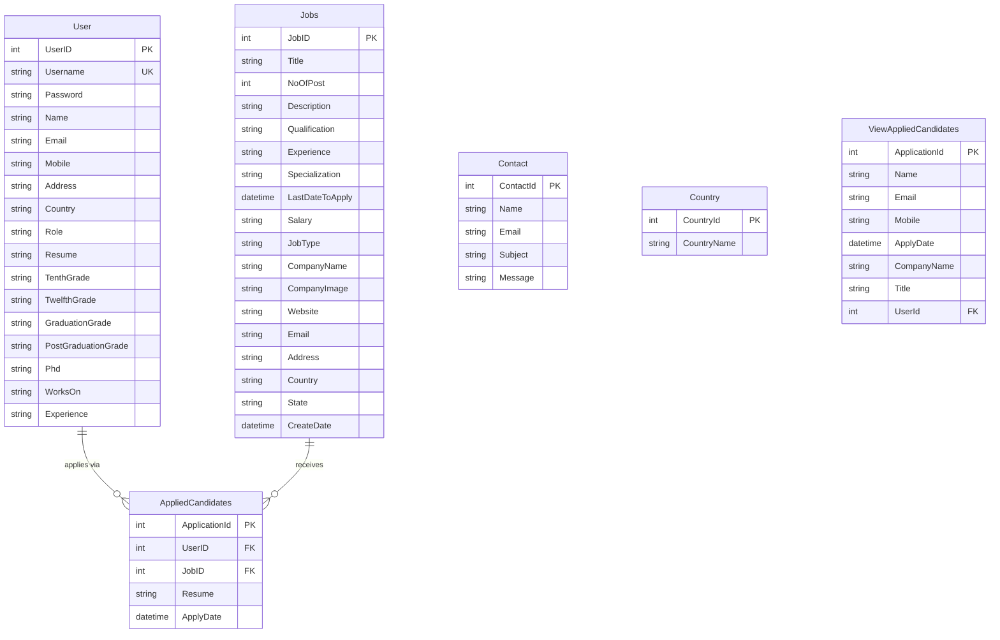

# Data Architecture & Persistence Layer

The Job Portal application uses a single MySQL database (`OnlineJobPortal`) accessed exclusively via raw ADO.NET (MySql.Data) with no ORM layer. The schema contains 5 primary tables inferred from SQL queries embedded in page code-behind files.

## Database Configuration

| Service/Module | DB Type | Profile/Env | Driver | Connection | Migration Tool |
|---|---|---|---|---|---|
| Job_Portal | MySQL | All (single config) | MySql.Data 9.2.0 (Oracle connector) | server=127.0.0.1; database=OnlineJobPortal; user id=root | None |

No schema migration tooling (Flyway, Liquibase, EF Migrations) is present. There are no seed data scripts, no schema version tracking, and no automated database provisioning. The database schema must be created and maintained manually. The `Web.config` `<connectionStrings>` section is the sole configuration point — see `configuration-inventory.md` for the full property listing.

## Data Ownership per Service

| Service | Tables Owned | ORM Framework | Caching | Notes |
|---|---|---|---|---|
| Job_Portal (monolith) | User, Jobs, AppliedCandidates, Contact, Country, ViewAppliedCandidates | Raw ADO.NET (no ORM) | None (ASP.NET Session for auth only) | ViewAppliedCandidates is likely a database VIEW joining User + Jobs + AppliedCandidates |

## Entity Model

> Note: `ViewAppliedCandidates` is a database VIEW (not a base table) inferred from the `SELECT` in `ViewResume.aspx.cs`. No CREATE TABLE DDL scripts are present in the repository — the full schema was inferred entirely from SQL queries in page code-behind files.

## Key Repository Methods

There is no repository layer. All data access is performed directly in page code-behind files via `MySqlConnection` and `MySqlCommand`. The table below documents the key SQL operations by page:

| Page / File | Operation | SQL Pattern | Tables Used |
|---|---|---|---|
| Login.aspx.cs | Read (authenticate) | SELECT * FROM User WHERE Username=? AND ****** AND Role=? | User |
| Register.aspx.cs | Create | INSERT INTO User (Username, Password, Name, ..., Role) | User |
| Profile.aspx.cs | Read / Update | SELECT UserID, Name, ... FROM User WHERE UserID=? / UPDATE User SET ... | User |
| ResumeBuild.aspx.cs | Read / Update | SELECT * FROM User WHERE Username=? / UPDATE User SET TenthGrade, ..., Experience ... | User |
| Job_Listing.aspx.cs | Read (filtered) | SELECT * FROM Jobs WHERE 1=1 [+ dynamic WHERE clauses] | Jobs |
| Job_Details.aspx.cs | Read / Create / Check | SELECT * FROM Jobs WHERE JobID=? / SELECT COUNT(*) FROM AppliedCandidates ... / INSERT INTO AppliedCandidates | Jobs, AppliedCandidates, User |
| NewJob.aspx.cs | Create | INSERT INTO Jobs (Title, NoOfPost, ..., CompanyImage, ...) | Jobs |
| JobList.aspx.cs | Read / Update / Delete | SELECT * FROM Jobs / UPDATE Jobs SET ... / DELETE FROM Jobs WHERE JobId=? | Jobs |
| Dashboard.aspx.cs | Aggregate reads | SELECT COUNT(*) FROM User/Jobs/AppliedCandidates/Contact | User, Jobs, AppliedCandidates, Contact |
| ViewResume.aspx.cs | Read / Delete | SELECT ... FROM ViewAppliedCandidates / DELETE FROM AppliedCandidates WHERE ApplicationId=? | ViewAppliedCandidates, AppliedCandidates |
| ContactList.aspx.cs | Read / Delete | SELECT * FROM Contact ORDER BY ContactId DESC / DELETE FROM Contact WHERE ContactId=? | Contact |
| Contact.aspx.cs | Create | INSERT INTO Contact (Name, Email, Subject, Message) | Contact |
| ProfileProvider.aspx.cs | Read / Update | SELECT UserID, Name, ... FROM User WHERE UserID=? / UPDATE User SET ... | User |

## Caching Strategy

No caching layer of any kind is configured or implemented:

- No in-memory cache (MemoryCache, HttpRuntime.Cache)
- No distributed cache (Redis, Memcached)
- No query result caching or second-level cache
- No output caching (`[OutputCache]` directive)
- ASP.NET Session is used exclusively for authentication state (Username, UserID, Role) — not for data caching

Every page load re-executes fresh SQL queries against the MySQL database. Under any meaningful load this will create heavy database contention, particularly for the Dashboard aggregate queries which scan entire tables on every page load.

## Data Ownership Boundaries

The application uses a **shared single-schema database** with no logical or physical partitioning between the Job Seeker and Job Provider functional areas. Both roles read and write the same `User`, `Jobs`, and `AppliedCandidates` tables. The role distinction is enforced only at the application layer via the `Role` column value in the `User` table.

**Cross-service data access**: Not applicable — the application is a monolith. All pages share the same connection string and access all tables directly.

**Read/write patterns**: There is no CQRS or read-replica configuration. All reads and writes go to the same MySQL instance. The `ViewAppliedCandidates` database VIEW is the only query optimization present; it pre-joins User + Jobs + AppliedCandidates to simplify the ViewResume page query.

**Dynamic SQL construction risk**: `Job_Listing.aspx.cs` builds a `WHERE 1=1` clause with string concatenation based on filter controls. While parameters are used for values, the column/condition structure is assembled dynamically — this warrants careful review during migration.

### Data Classification & Sensitivity

| Entity | Sensitive Fields | Classification | Controls in Place |
|---|---|---|---|
| User | Username, Password, Name, Email, Mobile, Address, Country, Resume (file path) | PII | **None** — passwords stored in plaintext; no encryption-at-rest; no field masking |
| Jobs | Email, Website, Address | PII (company contact) | None |
| AppliedCandidates | UserID, Resume (file path) | PII (links to candidate identity) | None |
| Contact | Name, Email | PII | None |
| Country | CountryName | None | N/A |

**Summary**: The application stores significant PII (candidate personal details, contact information, resume files). **Passwords are stored and compared in plaintext** — there is no hashing, salting, or encryption. No encryption-at-rest is configured for the database. No field-level access controls, data masking, or audit logging are present. Resume PDF files are stored on the local file system with no access controls beyond the IIS application permissions.
