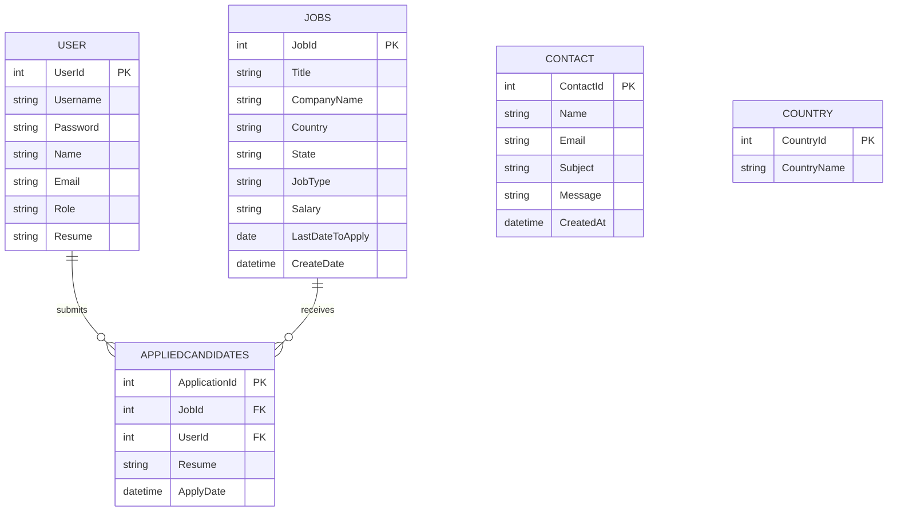

# Data Architecture & Persistence Layer

The data layer is centered on a single MySQL schema used by all application flows, with persistence implemented via direct SQL from Web Forms code-behind files. Core domain data includes users, jobs, contacts, and candidate applications.

## Database Configuration

| Service/Module | DB Type | Profile | Driver | Connection | Migration Tool |
|---|---|---|---|---|---|
| Job_Portal | MySQL | Default (single environment config in Web.config) | MySql.Data.MySqlClient | `server=127.0.0.1;database=OnlineJobPortal;user id=root;****** | None detected |

## Data Ownership per Service

| Service | Tables Owned | ORM Framework | Caching | Notes |
|---|---|---|---|---|
| Job_Portal monolith | `User`, `Jobs`, `Contact`, `AppliedCandidates`, `Country`, `ViewAppliedCandidates` | ADO.NET with MySql.Data/MySqlConnector (no ORM) | None detected | Shared schema used by all job seeker/provider flows |

## Entity Model

## Key Repository Methods

| Service | Repository | Notable Methods | Purpose |
|---|---|---|---|
| Job_Portal | Inline SQL in `Login.aspx.cs` | `SELECT * FROM User WHERE Username=@Username AND ****** AND Role=@Role` | User authentication and role validation |
| Job_Portal | Inline SQL in `Register.aspx.cs` | `INSERT INTO User (...) VALUES (...)` | User onboarding |
| Job_Portal | Inline SQL in `Job_Listing.aspx.cs` | Dynamic filtered `SELECT * FROM Jobs WHERE ... ORDER BY CreateDate DESC` | Job search with filters and pagination |
| Job_Portal | Inline SQL in `Job_Details.aspx.cs` | `SELECT * FROM Jobs WHERE JobID=@JobID`; insert into `AppliedCandidates` | Job details retrieval and application submission |
| Job_Portal | Inline SQL in `JobList.aspx.cs` | `UPDATE Jobs ... WHERE JobId=@JobId`; `DELETE FROM Jobs WHERE JobId=@JobId` | Provider-side job maintenance |
| Job_Portal | Inline SQL in `ViewResume.aspx.cs` | `SELECT ... FROM ViewAppliedCandidates`; delete from `AppliedCandidates` | Candidate application review and cleanup |

## Caching Strategy

| Area | Provider | TTL/Eviction | Pattern | Rationale |
|---|---|---|---|---|
| Application data | None detected | N/A | Direct database access | Simpler legacy architecture without cache layer |
| Session auth state | ASP.NET session state | Framework-managed | Session-based context | Tracks logged-in user and role per browser session |

## Data Ownership Boundaries

The application uses a shared-database monolith pattern. Job seeker and job provider features read and write the same tables in a single schema without service-level ownership boundaries. Cross-feature data access is direct SQL against shared tables and a database view (`ViewAppliedCandidates`) for reporting-style joins.

### Data Classification & Sensitivity

| Entity | Sensitive Fields | Classification (PII/PHI/PCI/None) | Controls in Place |
|---|---|---|---|
| USER | Name, Email, Mobile, Address, Resume, Password | PII | Session-based access checks; no explicit encryption or masking detected |
| JOBS | CompanyName, Email, Address fields in posting forms | PII | No explicit field-level masking detected |
| CONTACT | Name, Email, Message | PII | No explicit encryption or masking detected |
| APPLIEDCANDIDATES | UserId, Resume, Email (in view output) | PII | Access controlled by provider pages; no explicit encryption at rest detected |
