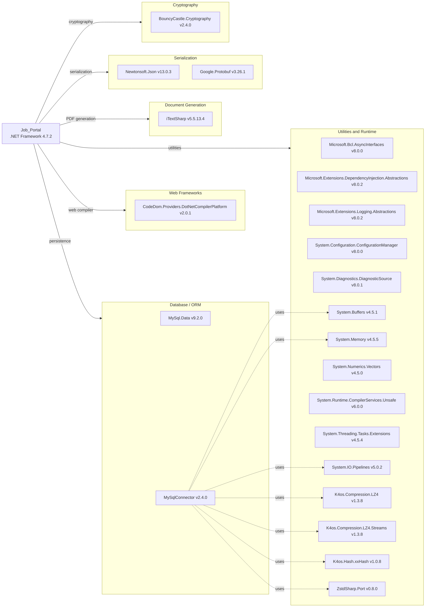

# Dependency Map

The Job Portal project is a .NET Framework 4.7.2 ASP.NET WebForms application with 22 declared NuGet dependencies listed in `packages.config`. There are no test-scoped dependencies detected.

## Dependencies

### Dependency Summary

| Category | Count | Key Libraries | Notes |
|---|---|---|---|
| Web Frameworks | 1 | Microsoft.CodeDom.Providers.DotNetCompilerPlatform 2.0.1 | Roslyn compiler for WebForms; ASP.NET WebForms itself is in-box |
| Database / ORM | 2 | MySql.Data 9.2.0, MySqlConnector 2.4.0 | Two competing MySQL drivers — both present, only MySql.Data appears used in code |
| Document Generation | 1 | iTextSharp 5.5.13.4 | AGPL-licensed legacy PDF library; no longer actively maintained |
| Serialization | 2 | Newtonsoft.Json 13.0.3, Google.Protobuf 3.26.1 | JSON used for dashboard charts; Protobuf pulled in as transitive dep of MySqlConnector |
| Cryptography | 1 | BouncyCastle.Cryptography 2.4.0 | Pulled in as transitive dependency of MySqlConnector |
| Utilities / Runtime | 15 | System.Memory, System.Buffers, K4os.Compression.LZ4, ZstdSharp.Port, etc. | Mostly transitive dependencies of MySqlConnector's async/compression pipeline |

### Version & Compatibility Risks

**Microsoft.CodeDom.Providers.DotNetCompilerPlatform 2.0.1** is an old release (2018) used only by the .NET Framework WebForms compilation pipeline; it is irrelevant in any modern ASP.NET Core migration. **iTextSharp 5.5.13.4** is the final community release of the AGPL v5 branch — it is no longer actively maintained by iText Group and carries a viral AGPL license. The successor iText 7 requires a commercial license for non-AGPL use. Both **MySql.Data 9.2.0** and **MySqlConnector 2.4.0** are present but only `MySql.Data` is referenced in code; the `MySqlConnector` package and its entire dependency tree (LZ4, xxHash, ZstdSharp, Pipelines, BouncyCastle, Protobuf) appear to be unused bloat. The `System.Configuration.ConfigurationManager 8.0.0` package targets .NET Standard/Core back-compat shim and is unnecessary on .NET Framework 4.7.2 where this API is already built in.

### Notable Observations

- **Duplicate MySQL drivers**: Both `MySql.Data` (Oracle's official connector) and `MySqlConnector` (open-source async connector) are declared. Only `MySql.Data` is used in application code. `MySqlConnector` and its ~13 transitive dependencies should be removed to reduce the dependency surface.
- **Bloated transitive dependency tree from MySqlConnector**: The compression (LZ4, ZstdSharp), hashing (xxHash), cryptography (BouncyCastle), and networking (System.IO.Pipelines) packages are all pulled in transitively by the unused `MySqlConnector`. Removing it would eliminate approximately 15 of the 22 declared packages.
- **AGPL license risk (iTextSharp)**: iTextSharp 5.x is AGPL-3.0 licensed. Any distribution of the application must comply with AGPL terms (source disclosure) unless a commercial iText license is obtained. This requires legal review before any commercial deployment.
- **No ORM layer**: The project uses raw ADO.NET SQL strings throughout. There is no Entity Framework or Dapper usage. This increases maintenance burden and makes migration to EF Core or another ORM a prerequisite for modernization.

## Test Dependencies

No test-scoped dependencies were detected. There are no test projects, unit test files, or test frameworks (xUnit, NUnit, MSTest) present in the repository.

Total test-scope dependencies: **0**

No automated test infrastructure exists. This is a significant risk for any modernization effort — refactoring code without a test harness makes regressions very difficult to detect. Adding unit and integration tests should be a first step before attempting any migration.
