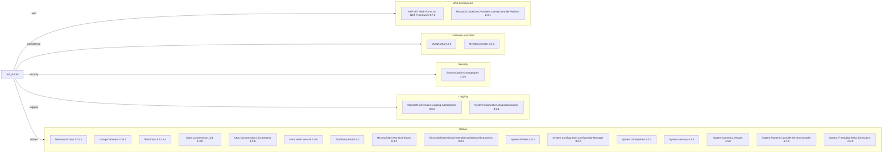

# Dependency Map

This dependency map covers declared NuGet dependencies for Job_Portal from `packages.config` and project references in `Job_Portal.csproj` (24 external packages detected).

## Dependencies

### Dependency Summary

| Category | Count | Key Libraries | Notes |
|---|---:|---|---|
| Web Frameworks | 2 | ASP.NET Web Forms, DotNetCompilerPlatform | Legacy .NET Framework web stack |
| Database and ORM | 2 | MySql.Data, MySqlConnector | Two MySQL client libraries coexist |
| Security | 1 | BouncyCastle.Cryptography | Cryptographic primitives |
| Logging | 2 | Microsoft.Extensions.Logging.Abstractions, DiagnosticSource | Abstractions only, no dedicated sink package |
| Utilities | 17 | Newtonsoft.Json, iTextSharp, Google.Protobuf, System.* | Mixed modern package versions on net472 |

### Version & Compatibility Risks

The project targets .NET Framework 4.7.2, which constrains modernization paths and increases compatibility friction with newer 8.x dependency packages. The coexistence of both `MySql.Data` and `MySqlConnector` can introduce runtime behavior differences and duplicate transitive trees.

### Notable Observations

- `iTextSharp 5.5.x` is a legacy line and frequently flagged for modernization/licensing review.
- Multiple compression packages (`LZ4`, `xxHash`, `ZstdSharp`) are present without obvious central abstraction.
- Dependencies are managed via `packages.config` instead of SDK-style `<PackageReference>`.
- No explicit test-scoped dependencies were detected in build/package files.

## Test Dependencies

| Framework | Version | Notes |
|---|---|---|
| None detected | N/A | No test package declarations found in this project |

Total test-scope dependencies: 0
No test dependencies were detected from `packages.config` or project metadata.
